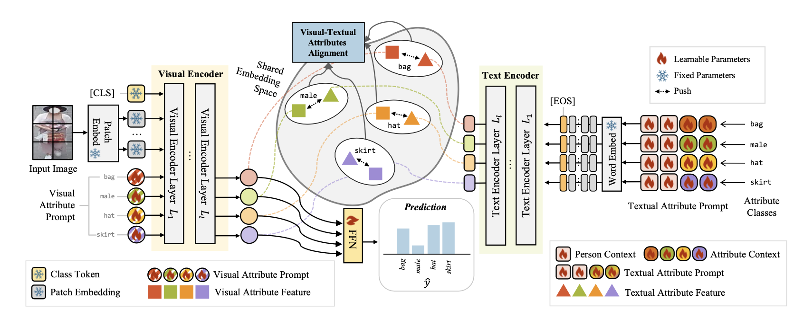

[](https://arxiv.org/pdf/2506.01411)

[[Project Page]](https://mlnjeongpark.github.io/ViTA-PAR)
[[arXiv]](https://mlnjeongpark.github.io/ViTA-PAR)


## Abstract
The Pedestrian Attribute Recognition (PAR) task aims to
identify various detailed attributes of an individual, such as
clothing, accessories, and gender. To enhance PAR perfor-
mance, a model must capture features ranging from coarse-
grained global attributes (e.g., for identifying gender) to
fine-grained local details (e.g., for recognizing accessories)
that may appear in diverse regions. Recent research suggests
that body part representation can enhance the model’s robust-
ness and accuracy, but these methods are often restricted to
attribute classes within fixed horizontal regions, leading to de-
graded performance when attributes appear in varying or un-
expected body locations. In this paper, we propose Visual and
Textual Attribute Alignment with Attribute Prompting for
Pedestrian Attribute Recognition, dubbed as ViTA-PAR, to
enhance attribute recognition through specialized multimodal
prompting and vision-language alignment. We introduce vi-
sual attribute prompts that capture global-to-local semantics,
enabling diverse attribute representations. To enrich textual
embeddings, we design a learnable prompt template, termed
person and attribute context prompting, to learn person and
attributes context. Finally, we align visual and textual at-
tribute features for effective fusion. ViTA-PAR is validated
on four PAR benchmarks, achieving competitive performance
with efficient inference. We release our code and model at
https://github.com/mlnjeongpark/ViTA-PAR.

## Code
The code will be released soon.

## Citation
```
@article{park2025vita,
  title={ViTA-PAR: Visual and Textual Attribute Alignment with Attribute Prompting for Pedestrian Attribute Recognition},
  author={Park, Minjeong and Park, Hongbeen and Kim, Jinkyu},
  journal={arXiv preprint arXiv:2506.01411},
  year={2025}
}
```

---

For questions or inquiries, feel free to contact `minjngpark@gmail.com`